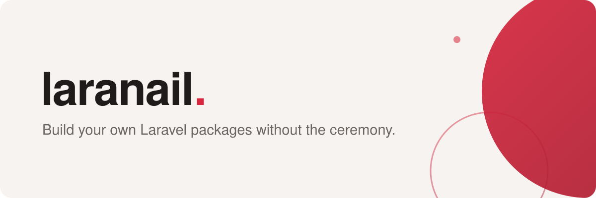

<div align="center">
  <a href="https://opensource.simtabi.com">
    <picture>
      <source media="(prefers-color-scheme: dark)" srcset="banner-dark.svg">
      
    </picture>
  </a>
</div>

<h1 align="center">laranail</h1>

<p align="center">
  <strong>Build your own Laravel packages without the ceremony.</strong><br>
  A family of Laravel packages by the team at Simtabi. Modern PHP, pure Composer
  tooling, no surprises.
</p>

<p align="center">
  <a href="https://opensource.simtabi.com/documentation/laranail/"></a>
  <a href="https://github.com/laranail/package-tools/blob/main/LICENSE"></a>
  
  
</p>

---

## Why laranail exists

Every Laravel package starts with the same hour of ceremony: a service provider,
config publishing, migrations, command registration. laranail removes that hour.
`package-tools` gives you a fluent package builder in the tradition of
`spatie/laravel-package-tools`, then goes further — attribute-driven discovery,
a built-in health check, SBOM generation, and dependency audits against OSV.dev.
The scaffolder turns one command into a publish-ready package.

We build every one of our own packages with it, so the family keeps growing:
console foundations, database utilities, type-safe enums, licensing,
environment tooling, and installers.

## Start here

| Package | What it does |
| --- | --- |
| [`package-tools`](https://github.com/laranail/package-tools) | The runtime base — fluent `Package` builder, attribute discovery, and doctor/sbom/audit/ide-helper commands |
| [`package-scaffolder`](https://github.com/laranail/package-scaffolder) | Artisan commands and stubs that scaffold a new package in one step |
| [`toolkit`](https://github.com/laranail/toolkit) | A security-first Swiss-army toolkit — utilities, traits, middleware, macros, feature modules |
| [`console`](https://github.com/laranail/console) | Rich console output plus a prompts-and-forms layer with validators |
| [`db-tools`](https://github.com/laranail/db-tools) | Standalone database utilities — UUID/ULID traits, schema macros, soft-archive, backup and restore |

Beyond the core: database administration
([`db-console`](https://github.com/laranail/db-console) and its
[`db-console-webui`](https://github.com/laranail/db-console-webui)), licensing
([`license-kit`](https://github.com/laranail/license-kit),
[`license-verifier`](https://github.com/laranail/license-verifier),
[`demo-mode`](https://github.com/laranail/demo-mode),
[`product-updater`](https://github.com/laranail/product-updater)), environment
tooling ([`env-kit`](https://github.com/laranail/env-kit)), installers
([`installer-headless`](https://github.com/laranail/installer-headless),
[`installer-web`](https://github.com/laranail/installer-web)), and type-safe
enums ([`enumerator`](https://github.com/laranail/enumerator)). Browse
[all repositories](https://github.com/orgs/laranail/repositories) for the full
family.

## Quick start

```bash
composer require laranail/package-tools
composer require --dev laranail/package-scaffolder

php artisan packager:generate vendor widget
php artisan laranail::package-tools.doctor
```

A minute from install to a scaffolded, health-checked package. Documentation
lives at [opensource.simtabi.com/documentation/laranail](https://opensource.simtabi.com/documentation/laranail/) and in each
repository's `docs/` directory.

## Need a hand?

- Questions and ideas: open an issue on the package's repository.
- Docs are never finished — pull requests are welcome on any repository's
  `docs/` tree.
- Security: see the repository's `SECURITY.md` and report privately, never via
  public issues.

## About Simtabi

laranail is built and maintained by the team at [Simtabi](https://simtabi.com),
a software design agency and design & branding studio operating across New
York, Delaware, and North Carolina, USA. Whenever we build something reusable,
we share it —
you'll find everything at
[opensource.simtabi.com](https://opensource.simtabi.com).

All laranail packages are open-source software licensed under the
[MIT license](https://github.com/laranail/package-tools/blob/main/LICENSE).
